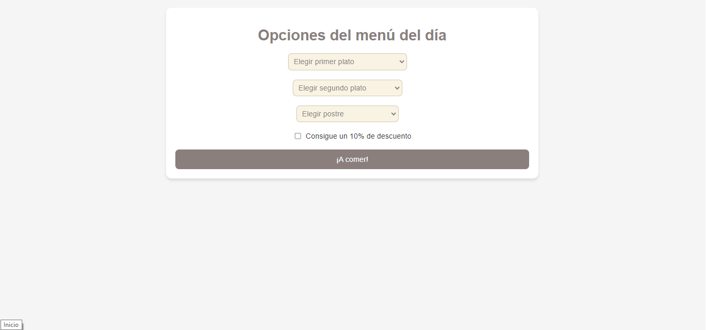
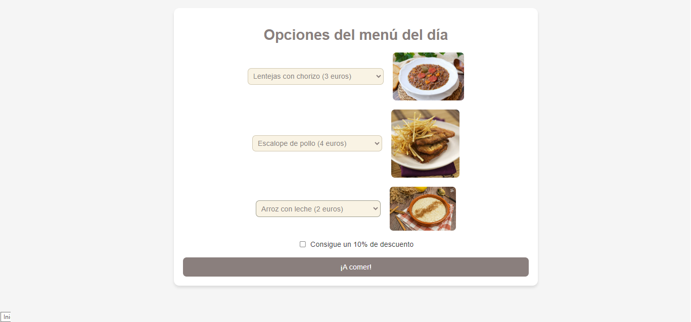
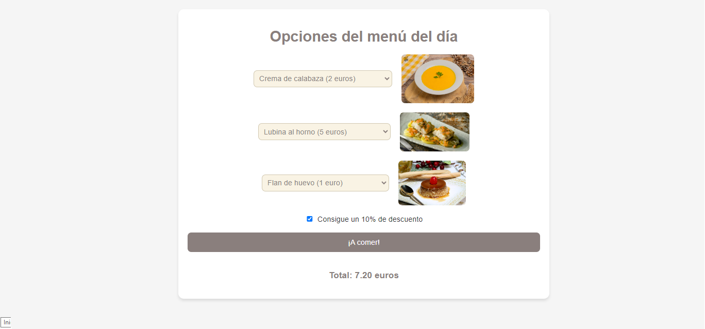

# 🥘 Menú del Día 🍽️

Este es un proyecto web interactivo donde los usuarios pueden seleccionar opciones de un menú del día (primer plato, segundo plato y postre), con la opción de aplicar un descuento del 10% al total de la compra. El precio se calcula dinámicamente y las imágenes de los platos cambian según las elecciones del usuario.


### Funcionalidades:
- 🥣 Elección de primer plato
- 🍖 Elección de segundo plato
- 🍮 Elección de postre
- 💸 Aplicación de un descuento del 10% (opcional)
- 🔢 Cálculo dinámico del precio total

## ⚙️ Instalación

Sigue estos pasos para instalar y ejecutar el proyecto en tu máquina local:

1. **Clona este repositorio**:
    ```bash
    git clone https://github.com/tu-usuario/menudeldia.git
    ```

2. **Accede a la carpeta del proyecto**:
    ```bash
    cd menudeldia
    ```

3. **Abre el archivo `index.html` en tu navegador**:
    - Simplemente haz doble clic en el archivo `index.html` o abre el archivo en tu editor de código y previsualízalo.

## 🎨 Tecnologías Utilizadas

- HTML
- CSS
- JavaScript

## 🖼️ Vista Previa





## 🛠️ Instrucciones de Uso

1. Selecciona un **primer plato**.
2. Selecciona un **segundo plato**.
3. Escoge un **postre**.
4. Si deseas, marca la casilla de descuento para obtener un 10% de descuento.
5. Haz clic en el botón **¡A comer!** para ver el total.

El total aparecerá solo cuando presiones el botón, mostrando el precio con el descuento (si está activado).

